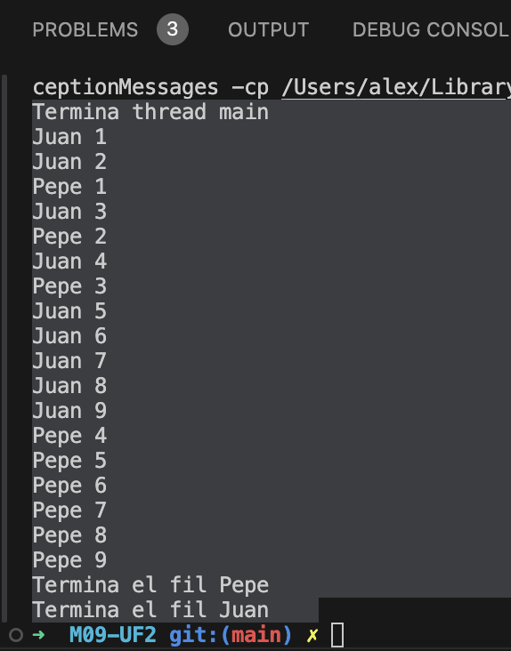
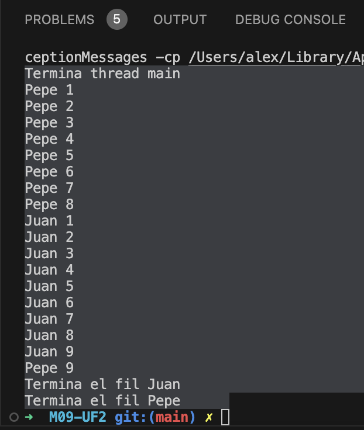
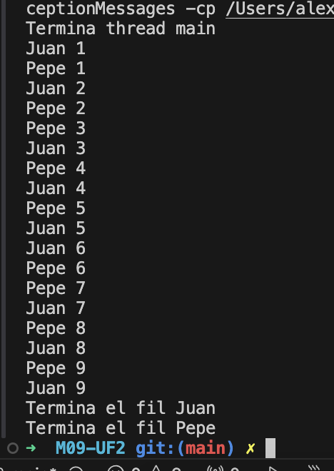

# Activitat 01: Programació de fils

## Clases inicials

### Principal.java

```java
public class Principal {
    public static void main(String[] args) {
        System.out.println("Termina thread main");

        Fil juan = new Fil("Juan");
        Fil pepe = new Fil("Pepe");

        juan.start();
        pepe.start();

    }
}
```

### Fil.java

```java
public class Fil extends Thread {
    private String name;

    public Fil(String name) {
        this.name = name;
    }

    @Override
    public void run() {
        for (int i = 1; i <= 9; i++) {
            System.out.println(name + " " + i);
        }
        System.out.println("Termina el fil " + name);
    }
}
```

## Comportament 1

### Sortida esperada

```bash
  Termina thread main
    Juan 1
    Juan 2
    Pepe 1
    Juan 3
    Pepe 2
    Juan 4
    Juan 5
    Pepe 3
    Pepe 4
    Pepe 5
    Pepe 6
    Pepe 7
    Pepe 8
    Pepe 9
    Juan 6
    Juan 7
    Juan 8
    Juan 9
    Termina el fil Juan
    Termina el fil Pepe
```

### Sortida obtinguda

```bash
Termina thread main
Juan 1
Juan 2
Pepe 1
Juan 3
Pepe 2
Juan 4
Pepe 3
Juan 5
Juan 6
Juan 7
Juan 8
Juan 9
Pepe 4
Pepe 5
Pepe 6
Pepe 7
Pepe 8
Pepe 9
Termina el fil Pepe
Termina el fil Juan
```



### Raó d'aquesta sortida

- Quan es criden els mètodes start() per a cada fil, el sistema operatiu assigna temps de CPU a cada fil per executar-se. Això vol dir que Juan i Pepe es poden executar en qualsevol ordre en qualsevol moment.
- No es pot controlar quina línia (de Juan o Pepe) es mostrarà primer, ja que la seva execució depèn de la planificació que fa el sistema operatiu.

## Comportament 2

### Canvis de prioritat

A la classe `Principal.java` se li afegeixen prioritats diferents:

```java
public class Principal {
    public static void main(String[] args) {
        System.out.println("Termina thread main");

        Fil juan = new Fil("Juan");
        Fil pepe = new Fil("Pepe");

        juan.setPriority(3);
        pepe.setPriority(9);

        juan.start();
        pepe.start();
    }
}
```

### Sortida esperada

```bash
Termina thread main
Pepe 1
Pepe 2
Pepe 3
Pepe 4
Pepe 5
Pepe 6
Pepe 7
Pepe 8
Pepe 9
Juan 1
Juan 2
Juan 3
Juan 4
Juan 5
Juan 6
Juan 7
Juan 8
Juan 9
Termina el fil Pepe
Termina el fil Juan
```

### Sortida obtinguda

```bash
Termina thread main
Pepe 1
Pepe 2
Pepe 3
Pepe 4
Pepe 5
Pepe 6
Pepe 7
Pepe 8
Juan 1
Juan 2
Juan 3
Juan 4
Juan 5
Juan 6
Juan 7
Juan 8
Juan 9
Pepe 9
Termina el fil Juan
Termina el fil Pepe
```



No es exactament igual però després de molts intents, ha sigut la més semblant...

## Comportament 3

### Posar el fil en sleep

Canvis a la classe `Fil.java` per afegir el metode `sleep()`:

```java
public class Fil extends Thread {
    private String name;

    public Fil(String name) {
        this.name = name;
    }

    @Override
    public void run() {
        for (int i = 1; i <= 9; i++) {
            System.out.println(name + " " + i);
            try {
                // Posem el fil en sleep per a que es vagin intercal·lant
                Thread.sleep(100);
            } catch (InterruptedException e) {
                System.out.println("El fil ha estat interromput.");
            }
        }
        System.out.println("Termina el fil " + name);
    }
}
```

### Sortida esperada

```bash
Termina thread main
Juan 1
Pepe 1
Juan 2
Pepe 2
Juan 3
Pepe 3
Juan 4
Pepe 4
Juan 5
Pepe 5
Juan 6
Pepe 6
Juan 7
Pepe 7
Juan 8
Pepe 8
Juan 9
Pepe 9
Termina el fil Pepe
Termina el fil Juan
```

### Sortida obtinguda

```bash
Termina thread main
Juan 1
Pepe 1
Juan 2
Pepe 2
Pepe 3
Juan 3
Pepe 4
Juan 4
Pepe 5
Juan 5
Juan 6
Pepe 6
Pepe 7
Juan 7
Pepe 8
Juan 8
Pepe 9
Juan 9
Termina el fil Juan
Termina el fil Pepe
```



### Raó d'aquesta sortida

Amb el mètode `Thread.sleep()` força pauses curtes entre les iteracions de cada fil, així l’ordre d'execució és estrictament alternat.
